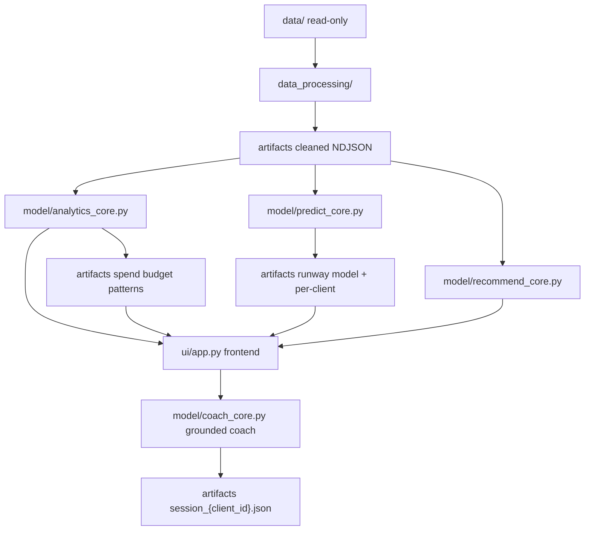

# Personal Finance Coach & Spending Analyzer

## Introduction

ClearLedger’s Personal Finance Coach & Spending Analyzer is a Python application that turns raw bank transactions into actionable guidance without manual tagging. The product combines four capabilities in one pipeline:

1. **LLM-based transaction auto-categorization** — eliminate manual tagging
2. **Spending analytics** — category spend, budget utilization, and interactive dashboard visuals
3. **Regression-based prediction** — days remaining before the user’s discretionary limit is reached
4. **Conversational financial coaching** — multi-turn grounded Q&A with stateful memory

A user supplies transaction history via CSV. The system auto-categorizes every row with an off-the-shelf LLM, renders an interactive spending dashboard, predicts how many days remain before the monthly discretionary limit is breached, ranks category-level spending reductions to extend that runway, and surfaces those grounded numbers inside a multi-turn conversational coach.

V1 is scoped for a six-week build: local Streamlit deployment, no model fine-tuning, and a single coherent pipeline. Every architectural choice (few-shot prompts, feature engineering, system-prompt injection) should be explainable against a business constraint, not only as a technique.

## Problem Statement

ClearLedger serves ~55,000 millennial and Gen Z subscribers, but users must manually tag 60–150 transactions before seeing insights. That friction drives **71% second-session churn**. Feedback shows users want actionable guidance, not static reports, while competitors prepare AI finance coaches. ClearLedger has roughly a six-week window to strengthen its Series A narrative.

**Target outcomes**

- Time-to-first-insight under **five minutes** (no manual tagging)
- Improve retention toward **50%** by delivering value in the first session

**Constraints that shape design**

- Limited in-house ML expertise → prefer off-the-shelf LLM APIs and a simple regression model
- No labeled training data for categories → few-shot prompting + MCC fallback
- Strict cost limits → batching, caching, cost caps, and graceful degradation when the API is unavailable
- Local deployment acceptable for v1 → Streamlit on a developer machine; source CSVs stay on disk and are never modified in place

## Architecture Overview

The system is a layered pipeline. Each stage adds value and writes durable flat artifacts that later stages (and the UI) can trust:

```
Data Ingestion → Data Processing → Analytics & Intelligence → Prediction
→ Recommendations → Notifications → UI (Dashboard + Coach) → Validation & Testing
```

**Backend vs frontend**

- **Backend:** notebooks + Python modules under `data_processing/` and `model/` compute and write `artifacts/`
- **Frontend:** `ui/app.py` is Streamlit-only — it selects a `client_id`, calls shared backends, and renders results (no duplicated analytics logic in the UI)

```
data/ (read-only)
  → data_processing/   # validate, clean, LLM categorize
  → artifacts/*.json   # flat derived files (gitignored; regenerable locally)
  → model/             # analytics, predict, recommend, coach, notify
  → ui/app.py          # Streamlit dashboard + coach
```

**Grounded AI rule:** the coach may only cite numbers that exist in computed artifacts. If a figure is missing or the request is outside available data, it must say so—never invent spend totals, limits, or projections.



## Folder Structure

Inputs are read only from `data/`. All derived outputs are written as flat files under `artifacts/` (gitignored except `.gitkeep`). Application code lives in domain folders plus tests.

```
.
├── data/                         # Source files only (read-only)
│   ├── transactions.csv
│   ├── cards.csv
│   ├── users.csv
│   └── mcc_codes.json
├── artifacts/                    # Derived outputs only (local / gitignored)
│   ├── .gitkeep
│   ├── transactions_enriched.json
│   ├── transaction_categories_{client_id}.jsonl
│   ├── merchant_profiles_{client_id}.json
│   ├── categorization_report_{client_id}.json
│   ├── llm_cache/
│   ├── qa_report.json
│   ├── spend_by_category_{client_id}.json
│   ├── spend_by_mcc_{client_id}.json
│   ├── budget_utilization_{client_id}.json
│   ├── spending_patterns_{client_id}.json
│   ├── runway_model.pkl
│   ├── runway_model_metrics.json
│   ├── runway_{client_id}.json
│   ├── monthly_limit_overrides.json
│   ├── recommendation_feedback_{client_id}.json
│   └── session_{client_id}.json
├── data_processing/
│   ├── validate_schema.ipynb
│   ├── clean.ipynb
│   ├── categorize_core.py
│   └── categorize.ipynb
├── model/
│   ├── analytics_core.py
│   ├── analytics.ipynb
│   ├── predict_core.py
│   ├── predict.ipynb
│   ├── recommend_core.py
│   ├── coach_core.py
│   └── notify.ipynb
├── ui/
│   └── app.py
├── tests/
│   ├── clean_tests.ipynb
│   ├── analytics_tests.ipynb
│   ├── predict_tests.ipynb
│   ├── categorize_tests.ipynb
│   ├── recommend_tests.ipynb
│   ├── coach_tests.ipynb
│   ├── llm_connection_tests.ipynb
│   ├── llm_connection_smoke.ipynb
│   └── ui_tests.ipynb
├── .env                          # secrets (never committed)
├── .env.example
├── requirements.txt
├── PROJECT_SPEC.md
└── README.md
```

| Concern                                            | Location                           | Why                                                            |
| -------------------------------------------------- | ---------------------------------- | -------------------------------------------------------------- |
| Schema validation, cleaning, joins, MCC enrichment | `data_processing/`                 | Trustworthy foundation without mutating source CSVs            |
| LLM auto-categorization + MCC fallback + cache     | `data_processing/categorize.ipynb` | Categorization is data prep that unlocks time-to-first-insight |
| Spending analytics (shared backend)                | `model/analytics_core.py`          | Single source of truth; UI stays presentation-only             |
| Prediction / recommendations / alerts / coach      | `model/`                           | Intelligence outputs that feed UI/coach                        |
| Dashboard + conversational coaching                | `ui/`                              | Presentation and stateful coaching                             |

## Dataset Specification

**Source files (read-only)** under `data/`:

| File               | Role                                                     |
| ------------------ | -------------------------------------------------------- |
| `transactions.csv` | Transaction records (amounts, timestamps, merchant, MCC) |
| `cards.csv`        | Card profiles linked to clients                          |
| `users.csv`        | Demographics + `monthly_discretionary_limits`            |
| `mcc_codes.json`   | MCC code → merchant category description                 |

**Demo user for screenshots/submission:** `client_id = 1696` (default in Streamlit).

**Join keys**

- `transactions.client_id` → `users.id`
- `transactions.card_id` → `cards.id`
- `transactions.mcc` → keys in `mcc_codes.json`

**Observed schemas**

`transactions.csv`:
`id`, `date`, `client_id`, `card_id`, `amount`, `use_chip`, `merchant_id`, `merchant_city`, `merchant_state`, `zip`, `mcc`, `errors`

`cards.csv`:
`id`, `client_id`, `card_brand`, `card_type`, `card_number`, `expires`, `cvv`, `has_chip`, `num_cards_issued`, `credit_limit`, `acct_open_date`, `year_pin_last_changed`, `card_on_dark_web`

`users.csv`:
`id`, `current_age`, `retirement_age`, `birth_year`, `birth_month`, `gender`, `address`, `latitude`, `longitude`, `per_capita_income`, `yearly_income`, `total_debt`, `credit_score`, `num_credit_cards`, `monthly_discretionary_limits`

`mcc_codes.json`:
`{ "<mcc_code>": "<description>", ... }`

**Quality risks (handled in processing)**

- Currency strings with `$` and commas
- Nullable / mixed location fields for online purchases
- Duplicate transactions
- MCC codes missing from the lookup → `UNKNOWN_MCC` (and LLM/MCC fallback)
- Historical 2010s dates → “today” is `AS_OF_DATE` (default: the user’s max transaction date)

**PII policy:** `address`, `card_number`, and `cvv` must not appear in UI, logs, prompts, or derived artifacts. Use `client_id` as the primary identifier.

## Module Specification

| Stage                  | Module                                                                    | Responsibility                                                                                         | Primary artifacts                                                                                         |
| ---------------------- | ------------------------------------------------------------------------- | ------------------------------------------------------------------------------------------------------ | --------------------------------------------------------------------------------------------------------- |
| Ingestion / validation | `data_processing/validate_schema.ipynb`                                   | Load read-only sources; inspect columns/dtypes/nulls                                                   | Notebook inspection                                                                                       |
| Processing             | `data_processing/clean.ipynb`                                             | Clean/standardize, dedupe, join users/cards/MCC for all users; QA report                               | `transactions_enriched.json`, `qa_report.json`                                                            |
| Categorization (LLM)   | `data_processing/categorize.ipynb` + `categorize_core.py`                 | Merchant-profile LLM categorization + batching + disk cache + MCC fallback + cost cap                  | `transaction_categories_{id}.jsonl`, `merchant_profiles_{id}.json`, `categorization_report_{id}.json`     |
| Analytics              | `model/analytics_core.py` + `analytics.ipynb`                             | Category spend, budget utilization, spending patterns; prefers LLM labels with MCC fallback            | `spend_by_category_{id}.json`, `budget_utilization_{id}.json`, `spending_patterns_{id}.json`              |
| Prediction             | `model/predict_core.py` + `predict.ipynb`                                 | Regression on discretionary history → projected month-end spend, overspend risk, days-to-limit         | `runway_model.pkl`, `runway_model_metrics.json`, `runway_{id}.json`                                       |
| Recommendations        | `model/recommend_core.py`                                                 | Ranked category/merchant spend-cut suggestions + accept/dismiss feedback                               | `recommendation_feedback_{id}.json`                                                                       |
| Notifications          | `model/notify.ipynb`                                                      | Budget threshold alerts (70/85/95)                                                                     | `events_{id}.jsonl`                                                                                       |
| Coach                  | `model/coach_core.py` + `ui/app.py` Coach tab                             | Multi-turn grounded chat with prediction/recommendation context and per-client session memory          | `session_{id}.json`                                                                                       |
| UI                     | `ui/app.py`                                                               | Streamlit dashboard + forecast + recommendations + coach                                               | Reads/triggers analytics, runway, limit overrides, session artifacts                                      |
| Tests                  | `tests/*.ipynb`                                                           | Unit tests for clean, analytics, predict, categorize, recommend, coach, UI; live LLM connection checks | Console PASS / fail                                                                                       |

**Critical degradation path:** if the LLM API is unreachable or the cost cap is hit → categorize via deterministic MCC mapping, record the degradation, and switch the coach to deterministic status mode that only presents computed analytics (no free-form invention).

Each module reads from `data/` or upstream artifacts and writes only under `artifacts/`.

## Environment & Configuration

- **Python:** 3.11+
- **Dependencies:** install from `requirements.txt` (pandas, pandera, openai, scikit-learn, streamlit, plotly, etc.)
- **Secrets (`.env`, never committed):** `LLM_PROVIDER`, `LLM_API_KEY`, `LLM_MODEL`, optional `OPENAI_BASE_URL` / `LLM_API_BASE`, optional overrides for `DATA_DIR`, `ARTIFACTS_DIR`, `AS_OF_DATE`
- **Runtime:**
  - Notebooks: run from project root (or resolve root via locating `data/`)
  - UI: `streamlit run ui/app.py` from project root

When the LLM is unavailable, configuration must force the documented fallback path and surface a clear UI warning—not a silent failure.

**Artifact git policy:** all files under `artifacts/` are gitignored except `artifacts/.gitkeep`. Recreate locally by running clean + categorize + analytics + predict (or using the UI once the model pickle exists).

## Known Constraints & Limitations

- **No labeled category ground truth:** evaluation uses QA metrics, spot checks, and MCC agreement—not supervised accuracy.
- **Historical data (2010s):** calendar “today” is not wall-clock now; use `AS_OF_DATE` (default: user’s latest transaction date).
- **LLM cost and quota:** calls must be batched and cached; exceeding caps triggers MCC fallback. Live LLM features depend on gateway quota.
- **Cold start / sparse history:** days-to-limit prediction can degrade with limited history; fallbacks are required.
- **Advice scope:** no personalized investment, tax, or legal advice—budget and spend analysis only.
- **PII:** address and card secrets stay out of prompts, logs, and UI.

## Evaluation Checklist

- [x] End-to-end demo for `client_id = 1696`: reads `data/` read-only, writes `artifacts/`, launches Streamlit, and the coach answers using only grounded computed values.
- [x] Four AI capabilities shown as one system: LLM categorization, interactive visualization, regression-based days-to-limit prediction, and stateful multi-turn coach memory.
- [x] Dashboard (user 1696): Monthly Limit Meter (actual vs projected), Customer Controls, Predicted Month-End Spend, Month-to-Date Discretionary Spend, Category Trend Chart with category buckets, Recommendations section.
- [ ] Chat interface (user 1696): multi-turn coach with stateful memory; MTD Spend / Limit / Projected shown; prediction and ranked recommendations injected as grounded coach context.
- [x] LLM categorization with MCC fallback + disk cache.
- [x] Ranked, category-level spending reduction recommendations surfaced in the dashboard.
- [x] Validation hooks / unit tests for clean, analytics, predict, categorize, recommend, coach, and UI.

## Implementation Checklist

- [x] Validate and clean source data (`validate_schema.ipynb`, `clean.ipynb`) → all-users NDJSON + QA report.
- [x] LLM auto-categorization with batching, cache, and MCC fallback (`categorize.ipynb` / `categorize_core.py`).
- [x] Analytics backend for spend, budget utilization, and patterns (`analytics_core.py`).
- [x] Streamlit dashboard for `client_id` selection, customer limit controls, and interactive spend visuals (`ui/app.py`).
- [x] Regression prediction for projected month-end spend / days-to-limit (`predict_core.py` / `predict.ipynb`) wired into the UI.
- [x] Ranked recommendation engine for category/merchant cutbacks (`recommend_core.py`) surfaced in the dashboard.
- [x] Multi-turn grounded coach with per-client session memory (`coach_core.py` + Coach tab).
- [ ] Inject days-to-limit and ranked recommendations into the coach grounded context (required by the write-up).
- [ ] Notification / threshold alerts (70/85/95 budget utilization) for the architecture’s notification stage.
- [x] Unit tests for each core module under `tests/`.
