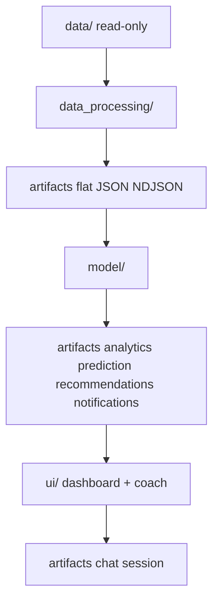

# Personal Finance Coach & Spending Analyzer

## Introduction

ClearLedger’s Personal Finance Coach & Spending Analyzer is a Python application that turns raw bank transactions into actionable guidance without manual tagging. To address early churn from manual tagging, ClearLedger’s product plan combines:

1. **LLM-based transaction auto-categorization** — eliminate manual tagging
2. **Spending analytics** — category spend, budget utilization, interactive dashboard visuals
3. **Anomaly detection** — flag unusual transactions and budget-threshold / overspend risk before the limit is breached
4. **Conversational financial coaching** — multi-turn grounded Q&A and action recommendations

A user (or demo operator) supplies transaction history via CSV; the system auto-categorizes every row with an off-the-shelf LLM, renders an interactive spending dashboard, detects unusual spend and limit-breach risk, predicts how many days remain before the user’s monthly discretionary limit is breached, ranks category-level spending reductions to extend that runway, and surfaces those grounded numbers inside a multi-turn conversational coach.

V1 is scoped for a six-week build: local Streamlit deployment, no model fine-tuning, and a single coherent pipeline. The graded learning objective still requires four AI capabilities integrated end-to-end—LLM classification, interactive visualization, regression-based prediction, and stateful coach memory—while anomaly detection is delivered as part of the analytics/prediction/notification path (unusual-txn heuristics + 70/85/95% limit alerts + days-to-limit risk).

## Problem Statement

ClearLedger serves ~55,000 millennial and Gen Z subscribers, but users must manually tag 60–150 transactions before seeing insights. That friction drives **71% second-session churn**. Feedback shows users want actionable guidance, not static reports, while competitors prepare AI finance coaches. ClearLedger has roughly a six-week window to strengthen its Series A narrative.

**Target outcomes**

- Time-to-first-insight under **five minutes** (no manual tagging)
- Improve retention toward **50%** by delivering value in the first session

**Constraints that shape design**

- Limited in-house ML expertise → prefer off-the-shelf LLM APIs and a simple per-user regression model
- No labeled training data for categories → few-shot prompting + MCC fallback; evaluate via QA and consistency, not supervised accuracy
- Strict cost limits → batching, caching, daily cost caps, and graceful degradation when the API is unavailable
- Local deployment acceptable for v1 → Streamlit on a developer machine; source CSVs stay on disk and are never modified in place

## Architecture Overview

The system is a layered pipeline. Each stage adds value and writes durable flat artifacts that later stages (and the UI) can trust:

```
Data Ingestion → Data Processing → Analytics & Intelligence → Prediction
→ Recommendations → Notifications → UI (Dashboard + Coach) → Validation & Testing
```

Mapped to implementation folders:

```
data/ (read-only)
  → data_processing/   # validate, clean (all users + focus export), LLM categorize
  → artifacts/*.json   # flat derived files (no nested artifact subfolders in v1)
  → model/             # spending analytics, anomaly/alerts, days-to-limit, recommendations
  → ui/                # Streamlit dashboard + conversational coach
```

**Product pillars → implementation homes**

| Product pillar | Where it lives |
|---|---|
| LLM auto-categorization | `data_processing/categorize.ipynb` |
| Spending analytics | `model/analytics.ipynb` + `ui/dashboard` |
| Anomaly detection | `model/analytics.ipynb` / `model/predict.ipynb` / `model/notify.ipynb` (unusual spend + runway risk + 70/85/95 alerts) |
| Conversational coaching | `ui/coach.ipynb` (grounded in artifacts) |

**Grounded AI rule:** the coach may only cite numbers that exist in computed artifacts. If a figure is missing or the request is outside available data, it must say so—never invent spend totals, limits, or projections.



## Folder Structure

Inputs are read only from `data/`. All derived outputs are written as **flat files** under `artifacts/` so source integrity is preserved and runs are reproducible. Application code lives in domain notebooks plus tests.

**Current + target layout**

```
.
├── data/                         # Existing source files only (read-only)
│   ├── transactions.csv
│   ├── cards.csv
│   ├── users.csv
│   └── mcc_codes.json
├── artifacts/                    # Derived outputs only (write-only, flat files)
│   ├── transactions_enriched.json          # NDJSON; all users (local / large; not committed)
│   ├── transactions_enriched_1696.json     # pretty JSON; focus demo user
│   └── qa_report.json                      # cleaning QA counters + assumptions
├── data_processing/
│   ├── validate_schema.ipynb     # done — schema inspection / validation
│   ├── clean.ipynb               # done — clean/join all users + focus export
│   └── categorize.ipynb          # planned — LLM categorization
├── model/                        # planned notebooks
│   ├── analytics.ipynb           # spending analytics (+ unusual-txn signals)
│   ├── predict.ipynb             # days-to-limit / projected month-end (overspend risk)
│   ├── recommend.ipynb           # ranked category reductions
│   └── notify.ipynb              # 70/85/95% limit anomaly alerts
├── ui/                           # planned Streamlit / coach notebooks
│   ├── app.ipynb
│   ├── dashboard.ipynb           # spending analytics visualizations
│   └── coach.ipynb               # conversational financial coaching
├── tests/
│   └── clean_tests.ipynb         # done — unit tests for clean helpers
├── config.yaml                   # planned non-secret defaults
├── .env                          # secrets (never committed)
├── requirements.txt
├── PROJECT_SPEC.md
├── README.md
└── codex_trail.txt
```

Placement rules (business-justified):

| Concern | Location | Why |
|---|---|---|
| Schema validation, cleaning, joins, MCC enrichment | `data_processing/` | Trustworthy foundation without mutating source CSVs |
| LLM auto-categorization + MCC fallback + cache | `data_processing/categorize.ipynb` | Categorization is data prep that unlocks time-to-first-insight; not the sklearn model |
| Spending analytics + anomaly signals (unusual txns, threshold alerts, overspend risk) | `model/` | Intelligence outputs that feed the UI/coach from cleaned data |
| Dashboard + conversational coaching (grounded memory) | `ui/` | Presentation and stateful coaching; reads artifacts only |

## Dataset Specification

**Source files (read-only)** under `data/`:

| File | Role | Approx. size |
|---|---|---|
| `transactions.csv` | Transaction records (amounts, timestamps, merchant, MCC) | ~699,938 rows |
| `cards.csv` | Card profiles linked to clients | 300 rows |
| `users.csv` | Demographics + `monthly_discretionary_limits` | 100 rows |
| `mcc_codes.json` | MCC code → merchant category description | 109 codes |

**Focus / demo user:** `FOCUS_CLIENT_ID = 1696` (screenshots, end-to-end demo, submission PDFs). Cleaning processes **all users** into a training-ready NDJSON artifact, and also exports a focus subset for user 1696. Downstream demo, prediction, dashboard, and coach still center on **1696**.

**Join keys**

- `transactions.client_id` → `users.id`
- `transactions.card_id` → `cards.id`
- `transactions.mcc` → keys in `mcc_codes.json`

**Observed schemas**

`transactions.csv`:
`id`, `date`, `client_id`, `card_id`, `amount`, `use_chip`, `merchant_id`, `merchant_city`, `merchant_state`, `zip`, `mcc`, `errors`

`cards.csv`:
`id`, `client_id`, `card_brand`, `card_type`, `card_number`, `expires`, `cvv`, `has_chip`, `num_cards_issued`, `credit_limit`, `acct_open_date`, `year_pin_last_changed`, `card_on_dark_web`

`users.csv`:
`id`, `current_age`, `retirement_age`, `birth_year`, `birth_month`, `gender`, `address`, `latitude`, `longitude`, `per_capita_income`, `yearly_income`, `total_debt`, `credit_score`, `num_credit_cards`, `monthly_discretionary_limits`

`mcc_codes.json`:
`{ "<mcc_code>": "<description>", ... }`

**Quality risks (handled in processing + QA report + safe fallbacks)**

- Currency strings with `$` and commas (e.g. `amount`, `monthly_discretionary_limits`, incomes)
- Nullable / mixed location fields for online purchases
- Duplicate transactions
- MCC codes missing from the lookup → `UNKNOWN_MCC` (and later LLM/MCC fallback path)
- Historical 2010s dates → “today” is `AS_OF_DATE` (default: the user’s max transaction date)

**PII policy:** `address`, `card_number`, and `cvv` must not appear in UI, logs, prompts, or derived artifacts. Use `client_id` as the primary identifier.

## Module Specification

| Stage | Module | Status | Responsibility | Primary artifacts |
|---|---|---|---|---|
| Ingestion / validation | `data_processing/validate_schema.ipynb` | Done | Load read-only sources; inspect columns/dtypes/nulls; document schema for approval | Notebook inspection outputs (no required artifact yet) |
| Processing | `data_processing/clean.ipynb` | Done | Clean/standardize, dedupe, join users/cards/MCC for **all users**; export focus subset; write QA report | `artifacts/transactions_enriched.json` (NDJSON, all users), `artifacts/transactions_enriched_1696.json`, `artifacts/qa_report.json` |
| Helper tests | `tests/clean_tests.ipynb` | Done | Unit-test clean helpers loaded from `clean.ipynb` | Console PASS / fail |
| Categorization (LLM auto-categorization) | `data_processing/categorize.ipynb` | Planned | Batched LLM categorization with disk cache; MCC-based fallback on outage/cap | `artifacts/categorized_{client_id}.jsonl` (or equivalent flat file) |
| Spending analytics | `model/analytics.ipynb` | Planned | Category spend, MTD discretionary, budget utilization, trends; flag unusual transactions vs user baselines | `artifacts/spend_by_category_{client_id}.json`, `artifacts/budget_utilization_{client_id}.json`, `artifacts/anomalies_{client_id}.json` |
| Prediction (overspend risk) | `model/predict.ipynb` | Planned | Per-user regression for days-to-limit / projected month-end spend; cold-start fallback | `artifacts/ridge_{client_id}.pkl`, `artifacts/runway_{client_id}.json`, `artifacts/prediction_{client_id}.json` |
| Recommendations | `model/recommend.ipynb` | Planned | Ranked category-level reductions with computed “days gained” impact | `artifacts/recommendations_{client_id}.json` |
| Notifications (anomaly alerts) | `model/notify.ipynb` | Planned | Emit 70% / 85% / 95% utilization events (v1: in-app) as budget-threshold anomalies | `artifacts/events_{client_id}.jsonl` |
| Conversational coaching + dashboard | `ui/app.ipynb`, `ui/dashboard.ipynb`, `ui/coach.ipynb` | Planned | Streamlit spending dashboard + multi-turn grounded coach with local session memory | `artifacts/session_{client_id}.json` |

**Cleaning behavior (current):**

- Parses currency → `amount_usd` / `*_usd` fields; parses datetimes → `transaction_dt`
- Normalizes ZIP, MCC, state; derives `is_online`; drops invalid amount/date rows
- Dedupes by transaction `id` (keep first)
- Left-joins non-PII card fields and user profile fields (excludes `address`, `card_number`, `cvv`)
- Adds `mcc_description` from `mcc_codes.json` (`UNKNOWN_MCC` when missing)
- Writes all-user NDJSON for reuse/training prep, plus a pretty JSON export for `FOCUS_CLIENT_ID=1696`

**Critical degradation path (later stages):** if the LLM API is unreachable or the daily cost cap is hit → categorize via deterministic MCC mapping (plus `Other/Uncategorized`) and switch the coach to deterministic “status” mode that only presents computed analytics and recommendations (no free-form invention).

Each module reads from `data/` or upstream artifacts and writes only under `artifacts/`.

## Environment & Configuration

- **Python:** 3.11+
- **Dependencies:** install from `requirements.txt` (pandas, pandera, openai, scikit-learn, streamlit, plotly, etc.)
- **Secrets (`.env`, never committed):** `LLM_PROVIDER`, `LLM_API_KEY`, `LLM_MODEL`, optional overrides for `DATA_DIR`, `ARTIFACTS_DIR`, `CLIENT_ID_DEFAULT` / `FOCUS_CLIENT_ID`, `AS_OF_DATE`
- **Non-secrets (`config.yaml`, planned):** paths, category taxonomy, discretionary mapping, notification thresholds (70/85/95), cost/rate caps, cold-start minimum history
- **Runtime:** notebooks run from project root (or resolve root via locating `data/`); local Streamlit planned for UI

When the LLM is unavailable, configuration must force the documented fallback path and surface a clear UI warning—not a silent failure.

**Artifact size note:** `artifacts/transactions_enriched.json` (all-users NDJSON) is large and should remain local / gitignored. Commit the smaller focus export and QA report as needed for demo reproducibility.

## Known Constraints & Limitations

- **No labeled category ground truth:** evaluation uses QA metrics, spot checks, and MCC agreement where available—not supervised accuracy.
- **Historical data (2010s):** calendar “today” is not wall-clock now; use `AS_OF_DATE` (default: user’s latest transaction date).
- **Single-user prediction sensitivity:** cold start and behavioral shifts can degrade the days-to-limit model; an explicit fallback policy is required. Cleaning may cover all users, but the demo prediction/UI path remains focused on one client (1696).
- **Cost and rate limits:** LLM calls must be batched and cached; exceeding caps triggers MCC fallback.
- **Advice scope:** no personalized investment, tax, or legal advice—budget and spend analysis only.
- **PII:** address and card secrets stay out of prompts, logs, and UI.

## Evaluation Checklist

- [ ] End-to-end demo for `client_id = 1696`: reads `data/` read-only, writes `artifacts/`, launches Streamlit, and the coach answers using only grounded computed values.
- [ ] Product pillars delivered: LLM auto-categorization, spending analytics, anomaly detection (unusual txns + threshold/runway risk), conversational coaching.
- [ ] Graded AI capabilities shown as one system: LLM categorization (cache + fallback), interactive visualization, regression-based days-to-limit prediction, and stateful multi-turn coach memory.
- [ ] Dashboard (user 1696): Monthly Limit Meter (actual vs projected), Customer Controls, Predicted Month-End Spend, Month-to-Date Discretionary Spend, Category Trend Chart with category buckets, Recommendations section.
- [ ] Chat interface (user 1696): usable multi-turn coach; MTD Spend, Limit, and Projected values visible as grounded context.
- [x] Validation hooks / unit tests cover clean helpers (`tests/clean_tests.ipynb`); expand later for schema/read-only/artifact contracts and e2e smoke for 1696.

## Implementation Checklist

- [x] Confirm `data/` schemas match this spec; document any drift and update join keys/handling rules (`validate_schema.ipynb`).
- [x] Implement `data_processing/clean.ipynb` → flat artifacts under `artifacts/` + QA report (all-users NDJSON + focus JSON for 1696).
- [x] Add `tests/clean_tests.ipynb` for clean helper unit tests.
- [ ] Implement `data_processing/categorize.ipynb` with batching, caching, and MCC fallback; verify 100% transaction coverage for the focus user.
- [ ] Implement `model/analytics.ipynb` so all dashboard figures are reproducible from artifacts; include unusual-transaction anomaly signals.
- [ ] Implement `model/predict.ipynb` (days-to-limit / projected month-end overspend risk) with cold-start fallback; write metrics as flat files under `artifacts/`.
- [ ] Implement `model/recommend.ipynb` with deterministic impact ranking (“days gained”).
- [ ] Implement `model/notify.ipynb` for 70/85/95 budget-threshold anomaly events as flat files under `artifacts/`.
- [ ] Implement `ui/` (spending dashboard + conversational coach) reading only `artifacts/`; persist chat as a flat file under `artifacts/`; show degraded mode on LLM outage.
- [ ] Expand `tests/`: read-only guarantee for `data/`, schema checks, artifact contracts, end-to-end smoke for `client_id=1696`.
