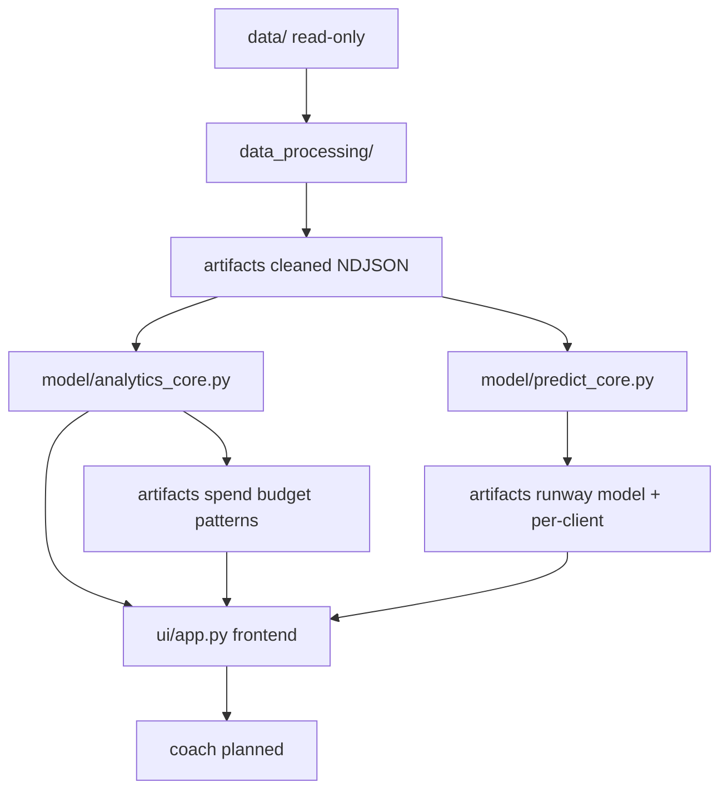

# Personal Finance Coach & Spending Analyzer

## Introduction

ClearLedger’s Personal Finance Coach & Spending Analyzer is a Python application that turns raw bank transactions into actionable guidance without manual tagging. To address early churn from manual tagging, ClearLedger’s product plan combines:

1. **LLM-based transaction auto-categorization** — eliminate manual tagging
2. **Spending analytics** — category spend, budget utilization, interactive dashboard visuals
3. **Anomaly detection** — flag unusual transactions and budget-threshold / overspend risk before the limit is breached
4. **Conversational financial coaching** — multi-turn grounded Q&A and action recommendations

A user (or demo operator) supplies transaction history via CSV; the system auto-categorizes every row with an off-the-shelf LLM, renders an interactive spending dashboard, detects unusual spend and limit-breach risk, predicts how many days remain before the user’s monthly discretionary limit is breached, ranks category-level spending reductions to extend that runway, and surfaces those grounded numbers inside a multi-turn conversational coach.

V1 is scoped for a six-week build: local Streamlit deployment, no model fine-tuning, and a single coherent pipeline. The graded learning objective still requires four AI capabilities integrated end-to-end—LLM classification, interactive visualization, regression-based prediction, and stateful coach memory—while anomaly detection is delivered as part of the analytics/prediction/notification path (unusual-txn heuristics + 70/85/95% limit alerts + days-to-limit risk).

## Required Outcomes & Learning Objective

**Functional outcomes the system must deliver**

- Ingest a user’s bank statement (CSV), auto-categorize transactions with an LLM (no manual tagging), and render an interactive spending dashboard.
- Predict how many days remain before the user reaches their self-set discretionary spending limit using a regression model trained on that user’s own transaction history.
- Generate **ranked, category-level spending reduction suggestions** that help extend that limit (impact ranked, e.g. “days gained”).
- Surface **both the prediction and the recommendations as grounded context** inside a **multi-turn conversational coach** (every numeric claim must come from computed artifacts).

**Broader learning objective**

Demonstrate that **four distinct AI capabilities** can be integrated into a **single, coherent, data-driven pipeline** rather than treated as isolated exercises:

1. **LLM-based classification** — transaction auto-categorization (`data_processing/categorize.ipynb`) — *implemented (optional step; cached)*
2. **Interactive data visualization** — Streamlit spending dashboard (`ui/app.py`) — *done (analytics views)*
3. **Regression-based prediction** — days-to-limit / projected month-end spend (`model/predict`*) — *planned*
4. **Stateful memory** — multi-turn coach session memory grounded in artifacts (`ui/` coach + `artifacts/session_{client_id}.json`) — *planned*

Every architectural choice (few-shot prompts, feature engineering, system-prompt injection of prediction/recommendations) should be explainable against a business constraint, not only as a technique.

## Problem Statement

ClearLedger serves ~55,000 millennial and Gen Z subscribers, but users must manually tag 60–150 transactions before seeing insights. That friction drives **71% second-session churn**. Feedback shows users want actionable guidance, not static reports, while competitors prepare AI finance coaches. ClearLedger has roughly a six-week window to strengthen its Series A narrative.

**Target outcomes**

- Time-to-first-insight under **five minutes** (no manual tagging)
- Improve retention toward **50%** by delivering value in the first session

**Constraints that shape design**

- Limited in-house ML expertise → prefer off-the-shelf LLM APIs and a simple per-user regression model
- No labeled training data for categories → few-shot prompting + MCC fallback; evaluate via QA and consistency, not supervised accuracy
- Strict cost limits → batching, caching, daily cost caps, and graceful degradation when the API is unavailable
- Local deployment acceptable for v1 → Streamlit on a developer machine; source CSVs stay on disk and are never modified in place


## Architecture Overview

The system is a layered pipeline. Each stage adds value and writes durable flat artifacts that later stages (and the UI) can trust:

```
Data Ingestion → Data Processing → Analytics & Intelligence → Prediction
→ Recommendations → Notifications → UI (Dashboard + Coach) → Validation & Testing
```

**Backend vs frontend (current design)**

- **Backend:** notebooks + Python modules under `data_processing/` and `model/` compute and write `artifacts/`
- **Frontend:** `ui/app.py` is Streamlit-only — it selects a `client_id`, calls `model/analytics_core.py`, and renders results (no duplicated analytics logic in the UI)

Mapped to implementation folders:

```
data/ (read-only)
  → data_processing/   # validate, clean (all users), LLM categorize (planned)
  → artifacts/*.json   # flat derived files (gitignored; regenerable locally)
  → model/             # analytics + predict done; recommend/notify planned
  → ui/app.py          # Streamlit frontend (any client_id via sidebar)
```

**Product pillars → implementation homes**


| Product pillar          | Where it lives                                           | Status                                                |
| ----------------------- | -------------------------------------------------------- | ----------------------------------------------------- |
| LLM auto-categorization | `data_processing/categorize.ipynb`                       | Done (analytics currently still uses rule-based MCC unless wired to read mapping) |
| Spending analytics      | `model/analytics_core.py` + `model/analytics.ipynb`      | Done                                                  |
| Anomaly detection       | predict runway risk (done) / notify thresholds (planned) | Partial                                               |
| Conversational coaching | `ui/` coach (grounded in artifacts)                      | Planned                                               |


**Grounded AI rule:** the coach may only cite numbers that exist in computed artifacts. If a figure is missing or the request is outside available data, it must say so—never invent spend totals, limits, or projections.




## Folder Structure

Inputs are read only from `data/`. All derived outputs are written as **flat files** under `artifacts/` (gitignored except `.gitkeep`). Application code lives in domain folders plus tests.

**Current + target layout**

```
.
├── data/                         # Existing source files only (read-only)
│   ├── transactions.csv
│   ├── cards.csv
│   ├── users.csv
│   └── mcc_codes.json
├── artifacts/                    # Derived outputs only (local / gitignored)
│   ├── .gitkeep
│   ├── transactions_enriched.json          # NDJSON; all users
│   ├── transaction_categories.jsonl        # LLM/MCC category mapping (all users)
│   ├── llm_cache/                          # diskcache for LLM categorization
│   ├── qa_report.json
│   ├── spend_by_category_{client_id}.json
│   ├── spend_by_mcc_{client_id}.json
│   ├── budget_utilization_{client_id}.json
│   ├── spending_patterns_{client_id}.json
│   ├── runway_model.pkl
│   ├── runway_model_metrics.json
│   └── runway_{client_id}.json
├── data_processing/
│   ├── validate_schema.ipynb     # done
│   ├── clean.ipynb               # done — clean/join all users
│   └── categorize.ipynb          # done — LLM categorization + MCC fallback + cache
├── model/
│   ├── __init__.py
│   ├── analytics_core.py         # done — shared analytics backend
│   ├── analytics.ipynb           # done — batch runner (default CLIENT_ID=1696)
│   ├── predict_core.py           # done — month-end spend / runway regression
│   ├── predict.ipynb             # done — train all-user model → artifacts
│   ├── recommend.ipynb           # planned
│   └── notify.ipynb              # planned
├── ui/
│   └── app.py                    # done — Streamlit frontend (analytics + forecast)
├── tests/
│   ├── clean_tests.ipynb         # done
│   ├── analytics_tests.ipynb     # done
│   ├── predict_tests.ipynb       # done
│   └── ui_tests.ipynb            # done
├── config.yaml                   # planned non-secret defaults
├── .env                          # secrets (never committed)
├── requirements.txt
├── PROJECT_SPEC.md
├── README.md
└── codex_trail.txt
```

Placement rules (business-justified):


| Concern                                            | Location                           | Why                                                            |
| -------------------------------------------------- | ---------------------------------- | -------------------------------------------------------------- |
| Schema validation, cleaning, joins, MCC enrichment | `data_processing/`                 | Trustworthy foundation without mutating source CSVs            |
| LLM auto-categorization + MCC fallback + cache     | `data_processing/categorize.ipynb` | Categorization is data prep that unlocks time-to-first-insight |
| Spending analytics (shared backend)                | `model/analytics_core.py`          | Single source of truth; UI stays presentation-only             |
| Prediction / recommendations / alerts              | `model/`                           | Intelligence outputs that feed UI/coach                        |
| Dashboard + conversational coaching                | `ui/`                              | Presentation and stateful coaching                             |


## Dataset Specification

**Source files (read-only)** under `data/`:


| File               | Role                                                     | Approx. size  |
| ------------------ | -------------------------------------------------------- | ------------- |
| `transactions.csv` | Transaction records (amounts, timestamps, merchant, MCC) | ~699,938 rows |
| `cards.csv`        | Card profiles linked to clients                          | 300 rows      |
| `users.csv`        | Demographics + `monthly_discretionary_limits`            | 100 rows      |
| `mcc_codes.json`   | MCC code → merchant category description                 | 109 codes     |


**Demo user for screenshots/submission:** `client_id = 1696` (default in Streamlit). Cleaning produces an all-users NDJSON; the UI can select **any** `client_id` from `users.csv` and compute analytics for that user via the backend.

**Join keys**

- `transactions.client_id` → `users.id`
- `transactions.card_id` → `cards.id`
- `transactions.mcc` → keys in `mcc_codes.json`

**Observed schemas**

`transactions.csv`:
`id`, `date`, `client_id`, `card_id`, `amount`, `use_chip`, `merchant_id`, `merchant_city`, `merchant_state`, `zip`, `mcc`, `errors`

`cards.csv`:
`id`, `client_id`, `card_brand`, `card_type`, `card_number`, `expires`, `cvv`, `has_chip`, `num_cards_issued`, `credit_limit`, `acct_open_date`, `year_pin_last_changed`, `card_on_dark_web`

`users.csv`:
`id`, `current_age`, `retirement_age`, `birth_year`, `birth_month`, `gender`, `address`, `latitude`, `longitude`, `per_capita_income`, `yearly_income`, `total_debt`, `credit_score`, `num_credit_cards`, `monthly_discretionary_limits`

`mcc_codes.json`:
`{ "<mcc_code>": "<description>", ... }`

**Quality risks (handled in processing + QA report + safe fallbacks)**

- Currency strings with `$` and commas (e.g. `amount`, `monthly_discretionary_limits`, incomes)
- Nullable / mixed location fields for online purchases
- Duplicate transactions
- MCC codes missing from the lookup → `UNKNOWN_MCC` (and later LLM/MCC fallback path)
- Historical 2010s dates → “today” is `AS_OF_DATE` (default: the user’s max transaction date)

**PII policy:** `address`, `card_number`, and `cvv` must not appear in UI, logs, prompts, or derived artifacts. Use `client_id` as the primary identifier.

## Module Specification


| Stage                    | Module                                                                                      | Status                      | Responsibility                                                                                                          | Primary artifacts                                                                                                      |
| ------------------------ | ------------------------------------------------------------------------------------------- | --------------------------- | ----------------------------------------------------------------------------------------------------------------------- | ---------------------------------------------------------------------------------------------------------------------- |
| Ingestion / validation   | `data_processing/validate_schema.ipynb`                                                     | Done                        | Load read-only sources; inspect columns/dtypes/nulls                                                                    | Notebook inspection                                                                                                    |
| Processing               | `data_processing/clean.ipynb`                                                               | Done                        | Clean/standardize, dedupe, join users/cards/MCC for **all users**; QA report                                            | `transactions_enriched.json`, `qa_report.json`                                                                         |
| Analytics backend        | `model/analytics_core.py`                                                                   | Done                        | MCC→category mapping, spend/budget/patterns compute, write per-client artifacts; called by UI                           | `spend_by_category_{id}.json`, `budget_utilization_{id}.json`, `spend_by_mcc_{id}.json`, `spending_patterns_{id}.json` |
| Analytics batch notebook | `model/analytics.ipynb`                                                                     | Done                        | Batch runner around `analytics_core` (default `CLIENT_ID=1696`)                                                         | Same analytics artifacts                                                                                               |
| UI frontend              | `ui/app.py`                                                                                 | Done (dashboard + forecast) | Streamlit: client select, analytics + prediction backends, charts/tables                                                | Reads/triggers analytics + `runway_{id}.json`                                                                          |
| Helper tests             | `tests/clean_tests.ipynb`, `analytics_tests.ipynb`, `predict_tests.ipynb`, `ui_tests.ipynb` | Done                        | Unit tests for clean helpers, analytics mapping, predict features, UI client-id parsing                                 | Console PASS / fail                                                                                                    |
| Categorization (LLM)     | `data_processing/categorize.ipynb` + `data_processing/categorize_core.py`                   | Done                        | Batched LLM categorization + cache + MCC fallback                                                                       | `transaction_categories.jsonl` (or `transaction_categories_{id}.jsonl`), `llm_cache/`                                 |
| Prediction               | `model/predict_core.py` + `model/predict.ipynb`                                             | Done                        | All-user Ridge regression → projected month-end discretionary, overspend risk, days-to-limit; UI scores selected client | `runway_model.pkl`, `runway_model_metrics.json`, `runway_{id}.json`                                                    |
| Recommendations          | `model/recommend.ipynb`                                                                     | Planned                     | Ranked category reductions (“days gained”)                                                                              | `recommendations_{id}.json`                                                                                            |
| Notifications            | `model/notify.ipynb`                                                                        | Planned                     | 70/85/95 utilization events                                                                                             | `events_{id}.jsonl`                                                                                                    |
| Coach                    | `ui/` coach                                                                                 | Planned                     | Multi-turn grounded chat + session memory                                                                               | `session_{id}.json`                                                                                                    |


**Cleaning behavior (current):**

- Parses currency → `amount_usd` / `*_usd` fields; parses datetimes → `transaction_dt`
- Normalizes ZIP, MCC, state; derives `is_online`; drops invalid amount/date rows
- Dedupes by transaction `id` (keep first)
- Left-joins non-PII card/user fields (excludes `address`, `card_number`, `cvv`)
- Adds `mcc_description` from `mcc_codes.json` (`UNKNOWN_MCC` when missing)
- Writes all-user NDJSON for reuse

**Analytics behavior (current):**

- Rule-based MCC category mapping (interim until LLM categorize lands)
- Discretionary categories drive MTD budget utilization vs `monthly_discretionary_limit_usd`
- UI switching `client_id` re-runs `analytics_core` for that user and refreshes per-client artifacts

**Prediction behavior (current):**

- Trains on all users’ daily discretionary spend (`predict.ipynb` → `runway_model.pkl`)
- Scores any selected client as-of date: projected month-end discretionary, overspend risk, days-to-limit estimate
- UI Overview + Forecast tabs call `predict_core.run_prediction_for_client` and write `runway_{client_id}.json`
- Days-to-limit may be `None` when implied remaining spend is ~0 (e.g. on-track / end-of-month)

**Critical degradation path (later stages):** if the LLM API is unreachable or the daily cost cap is hit → categorize via deterministic MCC mapping (plus `Other/Uncategorized`) and switch the coach to deterministic “status” mode that only presents computed analytics and recommendations (no free-form invention).

Each module reads from `data/` or upstream artifacts and writes only under `artifacts/`.

## Environment & Configuration

- **Python:** 3.11+
- **Dependencies:** install from `requirements.txt` (pandas, pandera, openai, scikit-learn, streamlit, plotly, etc.)
- **Secrets (**`.env`**, never committed):** `LLM_PROVIDER`, `LLM_API_KEY`, `LLM_MODEL`, optional overrides for `DATA_DIR`, `ARTIFACTS_DIR`, `AS_OF_DATE`
- **Non-secrets (**`config.yaml`**, planned):** paths, category taxonomy, discretionary mapping, notification thresholds (70/85/95), cost/rate caps, cold-start minimum history
- **Runtime:**
  - Notebooks: run from project root (or resolve root via locating `data/`)
  - UI: `streamlit run ui/app.py` from project root

When the LLM is unavailable, configuration must force the documented fallback path and surface a clear UI warning—not a silent failure.

**Artifact git policy:** all files under `artifacts/` are gitignored except `artifacts/.gitkeep`. Recreate locally by running clean + analytics + `model/predict.ipynb` (or using the UI, which calls analytics/predict backends once the model pickle exists).

## Known Constraints & Limitations

- **No labeled category ground truth:** evaluation uses QA metrics, spot checks, and MCC agreement where available—not supervised accuracy.
- **Historical data (2010s):** calendar “today” is not wall-clock now; use `AS_OF_DATE` (default: user’s latest transaction date).
- **Interim categorization:** analytics currently uses rule-based MCC mapping; LLM categorization is still planned for the graded classification capability.
- **Single-user prediction sensitivity:** cold start and behavioral shifts can degrade the days-to-limit model; an explicit fallback policy is required.
- **Cost and rate limits:** LLM calls must be batched and cached; exceeding caps triggers MCC fallback.
- **Advice scope:** no personalized investment, tax, or legal advice—budget and spend analysis only.
- **PII:** address and card secrets stay out of prompts, logs, and UI.


## Evaluation Checklist

- [ ] End-to-end demo for `client_id = 1696`: reads `data/` read-only, writes `artifacts/`, launches Streamlit, and the coach answers using only grounded computed values.
- [ ] Product pillars delivered: LLM auto-categorization, spending analytics, anomaly detection (unusual txns + threshold/runway risk), conversational coaching.
- [ ] Graded AI capabilities shown as one system: LLM categorization (cache + fallback), interactive visualization, regression-based days-to-limit prediction, and stateful multi-turn coach memory.
- [ ] Dashboard (user 1696): Monthly Limit Meter (actual vs projected), Customer Controls, Predicted Month-End Spend, Month-to-Date Discretionary Spend, Category Trend Chart with category buckets, Recommendations section.
- [ ] Chat interface (user 1696): usable multi-turn coach with **stateful memory**; MTD Spend, Limit, Projected/days-to-limit **prediction**, and **ranked recommendations** injected as grounded context.
- [x] Interactive dashboard exists (`ui/app.py`) with client selector, MTD discretionary / utilization, category spend, patterns (partial rubric coverage).
- [x] LLM categorization implemented with MCC fallback + disk cache (`data_processing/categorize.ipynb`) and tested (`tests/categorize_tests.ipynb`).
- [x] Validation hooks / unit tests: `tests/clean_tests.ipynb`, `tests/analytics_tests.ipynb`, `tests/ui_tests.ipynb`.


## Implementation Checklist

- [x] Confirm `data/` schemas (`validate_schema.ipynb`).
- [x] Implement `data_processing/clean.ipynb` → all-users NDJSON + QA report.
- [x] Add `tests/clean_tests.ipynb`.
- [x] Implement analytics backend (`model/analytics_core.py`) + batch notebook (`model/analytics.ipynb`).
- [x] Implement Streamlit frontend (`ui/app.py`) that calls analytics backend for any `client_id`.
- [x] Add `tests/analytics_tests.ipynb` and `tests/ui_tests.ipynb`.
- [x] Gitignore regenerable `artifacts/*` (keep `.gitkeep` only).
- [x] Implement `model/predict` (days-to-limit / projected month-end) + wire Forecast into UI.
- [x] Add `tests/predict_tests.ipynb`.
- [x] Implement `data_processing/categorize.ipynb` (LLM + cache + MCC fallback).
- [x] Add `tests/categorize_tests.ipynb`.
- [ ] Wire analytics/UI to optionally join `transaction_categories.jsonl` for category display.
- [ ] Implement `model/recommend` with deterministic impact ranking (“days gained”).
- [ ] Implement `model/notify` for 70/85/95 events (optional if UI thresholds suffice for v1).
- [ ] Extend UI: recommendations section (limit meter / predicted month-end already in Forecast).
- [ ] Implement multi-turn grounded coach with session memory under `artifacts/`.
- [ ] Expand tests: artifact contracts + end-to-end smoke for `client_id=1696`.
